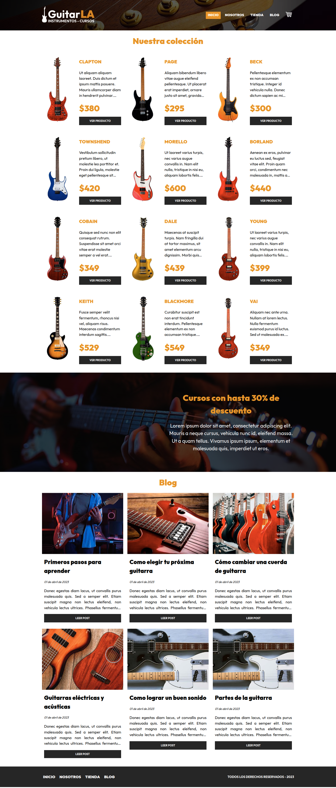
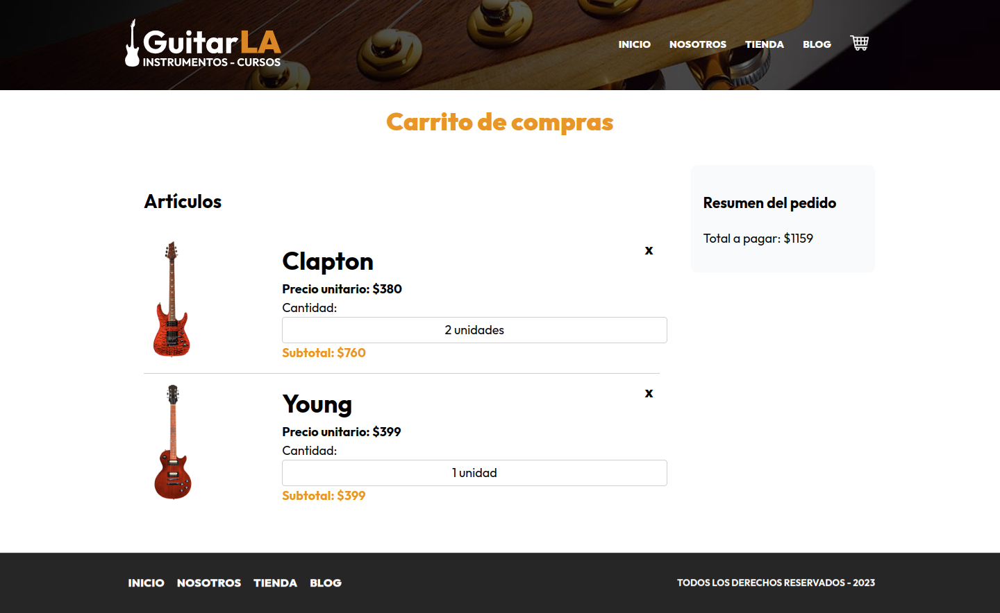

# Welcome to GuitarLA!

**GuitarLA** is a Remix Run project for a guitar sales website that allows users to browse guitar listings and add them to a cart. GuitarLA consumes data from an API developed with Strapi, allowing for dynamic and up-to-date guitar listings. The project was created to learn basic concepts of the Remix framework. 

## Installation

To install the project's dependencies, make sure you have Node.js and NPM installed on your machine. Then, follow these steps:

1. Clone this repository to your local machine
2. Open a terminal and navigate to the project directory
3. Run the command `npm install` to install the dependencies

## Usage

Before running the project, make sure you have your API server up and running. You can clone the [Strapi API](https://github.com/matiasagbenitez/guitarla-strapi) with which this project was developed, and start it through the command:

`npm run develop`

Once you have installed the dependencies, you can run the server locally. To do this, run the following command in the terminal:

`npm run dev`

This will start the server and open a browser window with the application.

## Gallery
On the main page, you can see the list of guitars obtained from the API. In the middle section, a promotional banner for a course. In the final part, you will see the list of blog posts.

By clicking on the different buttons, you can access the internal pages of the project.

You can add products to a cart and keep them thanks to the implementation of localStorage. You can also modify the amount of any of them or also remove one from the list.

Hope you enjoy the project!!!